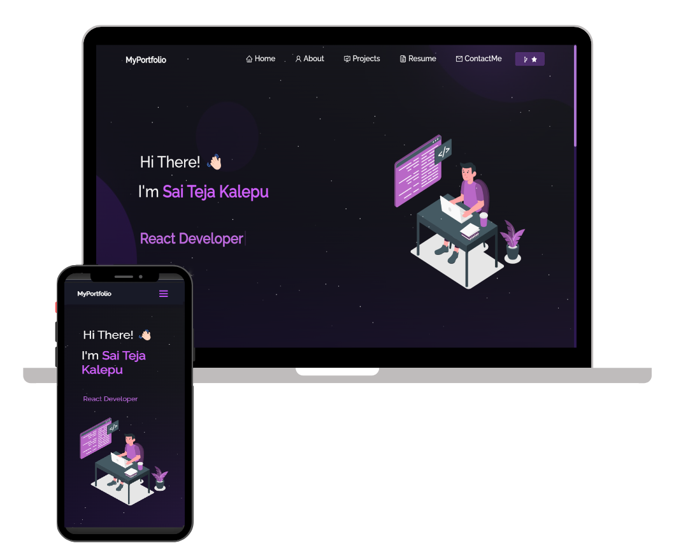

<h2 align="center">
  Portfolio Website 
  <a href="https://saitejakalepu-portfolio.web.app/" target="_blank">saitejakalepu-portfolio.web.app/</a>
</h2>

  

 

 &nbsp;
 &nbsp;
 &nbsp;

<h3 align="center">
    🔹
    <a href="https://github.com/saitejakalepu/portfolio/issues">Report Bug</a> &nbsp; &nbsp;
    🔹
    <a href="https://github.com/saitejakalepu/portfolio/issues">Request Feature</a>
</h3>

## Built With

My personal portfolio <a href="https://saitejakalepu-portfolio.web.app/" target="_blank">saitejakalepu-portfolio.web.app</a> which features some of my github projects as well as my resume and technical skills. 

This project was built using these technologies.

- React.js
- Node.js
- Email.js
- Firebase
- Bootstrap
- VsCode
- CSS3

## Features

**📖 Multi-Page Layout**

**🎨 Styled with React-Bootstrap and CSS with easy to customize colors**

**📱 Fully Responsive**

### Show your support

Give a ⭐ if you like this website!

